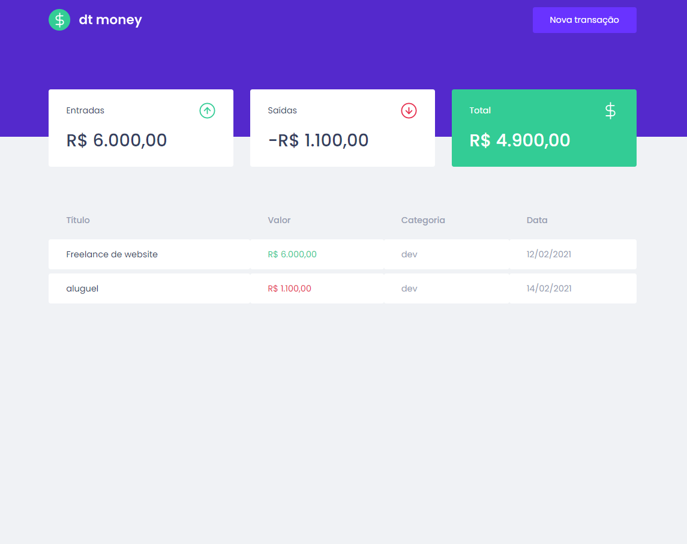
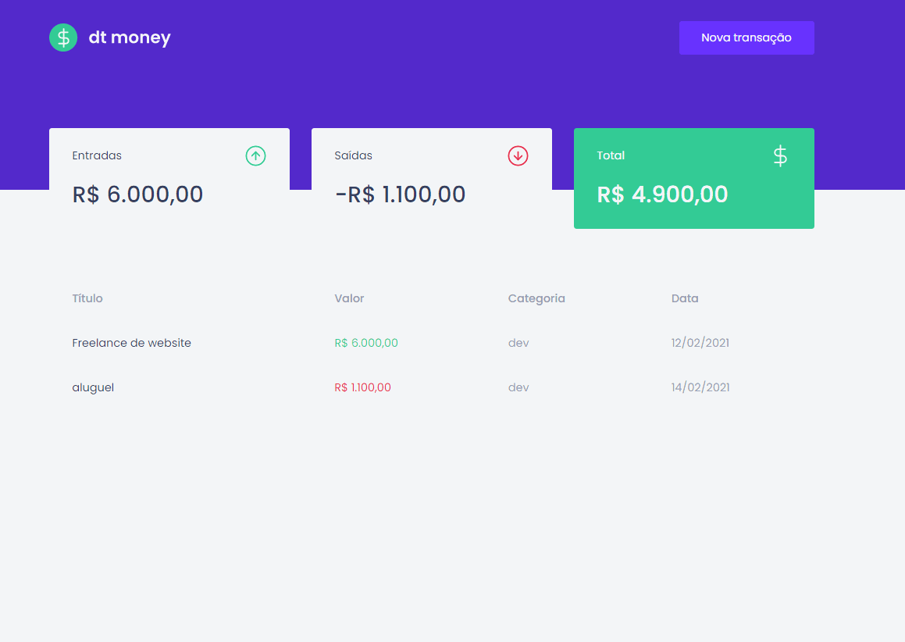

<h1 align="center">
    
</h1>

<h3 align="center">
    Projeto de controle de finanças utilizando <i>React</i> feito no curso Ignite da trilha React da RocketSeat 🚀
</h3>

<br />

<div align="center">
     
     
     

</div>

<br />

<div align="center">
    <a href="#tecnologias">Tecnologias</a> •
    <a href="#imagens">Imagens</a> •
    <a href="#usar">Como usar</a>
</div>

<br />

<div align="center" id="imagens">
    
    
</div>

<br />

<h1 id="tecnologias">Tecnologias 💾</h1>

### As seguintes tecnologias e ferramentas foram utilizadas na construção da aplicação.

- [React](https://pt-br.reactjs.org/)
- [TypeScript](https://www.typescriptlang.org/)
- [Axios](https://github.com/axios/axios)
- [Styled Components](https://styled-components.com/)
- [Yarn](https://yarnpkg.com/)

<br />

<h1 id="usar">Como usar 🎲</h1>

### Primeiramente você vai ter que ter instalado em seu computador o `git` e `yarn` ou `npm` para rodar a aplicação

```bash

# Primeiramente clone este repositório
$ git clone <https://github.com/lucaslc11/dt-money.git>

# Vá até a pasta do projeto e instale as dependências
$ yarn
# Ou
$ yarn install

# Rodando de forma local a aplicação
$ yarn start

# Este projeto não se utiliza de um backend, então não é preciso iniciar o server da aplicação

```

<br />
<hr />

### Por Lucaslc 💙<br />
### Bora se conhecer? 👇<br />
[LinkedIn](https://www.linkedin.com/in/lucas-louren%C3%A7o-7b6970144/) | 
[Instagram](https://www.instagram.com/lucaslc112/)